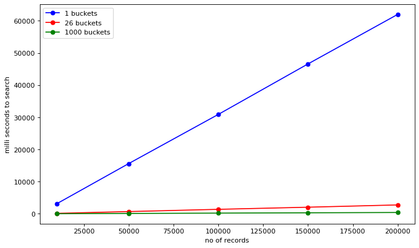
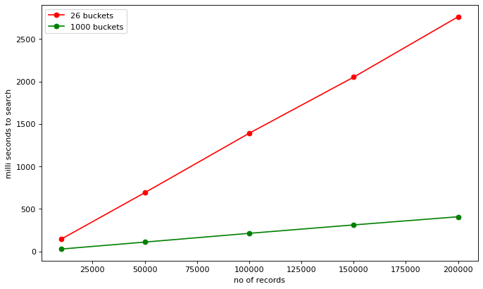

# What are Hashtables ?

1) Hashtables are an array that links a key to a specific data value(s), where each key is unique.
2) They are data structure that efficiently implements search/lookup operations.
3) It aims to divide the whole search space into well-defined regions, so we don’t have to search linearly through the entire collection to find an element.

# How do they work ?

1) Entire search space is divided into sections called Buckets. Each bucket has a corresponding Index.
2) Keys are converted to Indexes using a Hash-Function.
3) The (Key, Value) pairs are then stored in the appropriate bucket.

# Why do we need them?


1) Drastically speed up insert, delete and search operations.
2) Normal linear search takes O(N) time. Not good for large datasets.
3) Since search space is divided into buckets, Hashtables take approximately O(1) time to search. `</font>`

# Why is it interesting ? 🤔

1) Used in search engines like Google.
2) Several dynamic programming languages like Python, Java, and Ruby use hash tables to implement objects.import ipywidgets as widgets

## Selecting a random username to search.

```python
user_to_search = users[-random.randint(0,1000)][0]
user_to_search
```

    'PetreccaH98s9FER8N'

## Basic Linear search. Takes a lot of time 😔

```python
%%time 
t = [linear_search(users, user_to_search) for i in range(10000)]
```

    CPU times: user 2.96 s, sys: 18.9 ms, total: 2.98 s
    Wall time: 2.98 s

## Lets try searching using Hashtables with custom bucket size.

```python
table = create_empty_hash_table(s.value)
table = populate_hashtable_2(table, users)
```

```python
%%time 
tym = [htable_search_2(table, user_to_search) for i in range(10000)]
```

    CPU times: user 134 ms, sys: 561 µs, total: 135 ms
    Wall time: 134 ms





# Drawbacks

## 1) Collisions

### When 2 or more keys return the same index after hashing, they are placed in the same bucket which causes a collision.

## Methods to handle collision

### Chaining

### Other methods include Open Addressing, Cuckoo Hashing etc. but we can never eliminate it.

### Python dictionary uses Open Addressing to handle collisions.

## 2) The keys need to be unique hence we can't have duplicate or null values as keys.

# Could we make it better?

- Obviously increasing buckets number can improve performance
- Using a hybrid of hashtable and binary search for buckets reducing the worst time complexity to O(log n)
- Ultimately it comes to trade off between space and time. We need to keep it in reasonable range

# Implementation of Hashtables

## Description

In computing, a hash table, also known as hash map, is a data structure that implements an associative array or dictionary. It is an abstract data type that maps keys to values. A hash table uses a hash function to compute an index, also called a hash code, into an array of buckets or slots, from which the desired value can be found. During lookup, the key is hashed and the resulting hash indicates where the corresponding value is stored.

### Dependencies

* import random
* import string

### Installing

* run `git clone https://github.com/NeilChitre2311/communicationHW5.git`
* go into the `communicationHW5` folder created and open Presentation.ipynb (notebook file).

### Executing program

* Run the cell which contains all the functions.
* Run the cell which extracts a random name from 1000 names.
* Then run the cell which contains the linear search. This will search for the name and return a (name, passwprd) tuple. Check the time taken. It should be around 2.9s
* Run the cell which creates and populates the hashtable according to the hashfunction (with 1000 buckets).
* Run the cell which contains htable_search. This will search for the name and return a (name, password) tuple. Check the time taken. It should be around 134ms. Which is drastically less than linear search.

## Authors

* Neil Chitre (https://github.com/NeilChitre2311)
* Madhav Ponnudurai (https://github.com/pmadhav-usfca)
* Manish Vuppugandla (https://github.com/ManishKumarV)

## Version History

* 0.1
* Initial Release
